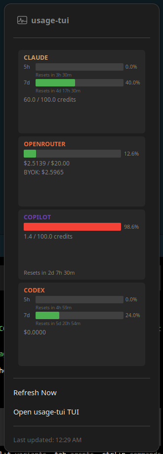

# gnomecodexbar

<p align="center">
  
  
  
  
</p>

<p align="center">
  <strong>Unified AI usage metrics in a fast terminal UI.</strong><br>
  Claude, OpenAI, OpenRouter, GitHub Copilot, and Codex, side by side.
</p>

<p align="center">
  <a href="#quick-start">Quick Start</a> |
  <a href="#features">Features</a> |
  <a href="#supported-providers">Providers</a> |
  <a href="#gnome-shell-extension">GNOME Extension</a> |
  <a href="#screenshots">Screenshots</a> |
  <a href="#contributing">Contributing</a>
</p>

## Features

- Interactive TUI built with Textual
- Unified dashboard across multiple providers
- Scriptable CLI with JSON output
- Cached requests to reduce API calls
- Normalized output format for automation
- Optional GNOME Shell extension in `extension/`
- Multiple time windows (5h, 7d, 30d)

## Supported Providers

| Provider | Status | Auth Required |
|----------|--------|---------------|
| Claude Code | OAuth (unofficial) | `CLAUDE_CODE_OAUTH_TOKEN` or Claude CLI |
| OpenAI | Official API | `OPENAI_ADMIN_KEY` |
| OpenRouter | Official API | `OPENROUTER_API_KEY` |
| OpenAI Codex | OAuth (unofficial) | `~/.codex/auth.json` or `CODEX_ACCESS_TOKEN` |
| GitHub Copilot | Device flow (internal API) | `usage-tui login --provider copilot` or `GITHUB_TOKEN` |

## Quick Start

```bash
# From source
pip install -e .

# Or with pipx
pipx install .

# Run setup wizard
usage-tui setup
```

### One-line setup for each provider

```bash
# Claude Code (uses existing CLI auth)
claude setup-token

# GitHub Copilot (device flow)
usage-tui login --provider copilot

# OpenAI / OpenRouter (set env vars)
export OPENAI_ADMIN_KEY=sk-...
export OPENROUTER_API_KEY=sk-or-...
```

## Usage

### Interactive TUI

```bash
usage-tui tui
```

Keyboard shortcuts:
- `r` - Refresh data
- `5` - Switch to 5 hour window
- `7` - Switch to 7 day window
- `j` - Toggle raw JSON view
- `q` - Quit

### CLI Commands

```bash
# Show all providers
usage-tui show

# Show specific provider
usage-tui show --provider claude
usage-tui show --provider openai

# Change time window
usage-tui show --window 5h
usage-tui show --window 30d

# Output as JSON (for scripting)
usage-tui show --json

# Check configuration
usage-tui doctor

# Show required env vars
usage-tui env
```

Notes:
- Default `usage-tui show` prints both 5-hour and 7-day windows for Claude and Codex
- Use `--window` to force a single window output

## Screenshots



## GNOME Shell Extension

The optional GNOME Shell extension displays AI usage metrics directly in your top panel.

### Requirements

- GNOME Shell 45, 46, 47, or 48
- `usage-tui` CLI installed and configured

### Installation

```bash
# Create the extension directory
mkdir -p ~/.local/share/gnome-shell/extensions/usage-tui@gnome.codexbar

# Copy extension files
cp extension/* ~/.local/share/gnome-shell/extensions/usage-tui@gnome.codexbar/
```

### Enabling the Extension

After copying the files, GNOME Shell must be restarted to detect the new extension.

**X11 Session:**
```bash
# Press Alt+F2, type 'r', press Enter
# Or run:
busctl --user call org.gnome.Shell /org/gnome/Shell org.gnome.Shell Eval s 'Meta.restart("Reloading…")'
```

**Wayland Session:**
```bash
# Log out and log back in (GNOME Shell cannot be restarted on Wayland)
```

**After restarting GNOME Shell:**
```bash
# Enable the extension
gnome-extensions enable usage-tui@gnome.codexbar

# Verify it's active
gnome-extensions info usage-tui@gnome.codexbar
```

### Development

Use the included dev script for extension development:

```bash
cd extension

# Enable/disable extension
./dev.sh enable
./dev.sh disable

# Reload extension (disable + enable)
./dev.sh reload

# View extension logs
./dev.sh logs

# Start nested GNOME Shell for testing (Wayland)
./dev.sh start
```

## Configuration

### Quick Setup

Run the interactive setup wizard:

```bash
usage-tui setup
```

This will prompt for API keys and save them to `~/.config/usage-tui/env`.

The env file uses simple `KEY=value` format. Environment variables override file values.

### Manual Configuration

### Claude Code (OAuth)

```bash
# Install and authenticate Claude CLI
npm install -g @anthropics/claude
claude setup-token

# Optional: extract token (uses CLI credentials automatically)
usage-tui login --provider claude

# Or set explicitly
export CLAUDE_CODE_OAUTH_TOKEN=sk-ant-oat01-...
```

Notes:
- Requires an OAuth token with the `user:profile` scope
- Uses an unofficial endpoint and may change
- Recommended: use Claude CLI credentials (unset `CLAUDE_CODE_OAUTH_TOKEN` unless you need to override)

### OpenAI (Admin API)

```bash
export OPENAI_ADMIN_KEY=sk-...
```

### OpenRouter

```bash
export OPENROUTER_API_KEY=sk-or-...
```

### OpenAI Codex (ChatGPT backend)

```bash
# Install and authenticate Codex CLI
npm install -g @openai/codex
codex

# Or set explicitly
export CODEX_ACCESS_TOKEN=eyJ...

Recommended: use Codex CLI credentials unless you need to override
```

### GitHub Copilot

```bash
# Device flow login (recommended)
usage-tui login --provider copilot

# Or set a token
export GITHUB_TOKEN=ghp_...

Recommended: use device flow login (avoids managing tokens)
```

## Project Structure

```
usage_tui/
  __init__.py
  cli.py           # CLI entry point
  tui.py           # Textual TUI application
  cache.py         # Caching layer
  config.py        # Configuration management
  providers/
    __init__.py
    base.py        # Base provider interface
    claude_oauth.py    # Claude Code OAuth provider
    openai_usage.py    # OpenAI usage provider
    codex.py           # OpenAI Codex usage provider
    copilot.py         # GitHub Copilot usage provider
```

## Architecture

```text
+---------------------------------------+
|             usage-tui CLI             |
|  CLI layer  |  TUI layer  |  GNOME UI |
+----------------------+----------------+
|        Provider cache and config      |
+----------------------+----------------+
| Claude | OpenAI | OpenRouter | Copilot |
| Codex  | adapters with normalized data |
+---------------------------------------+
```

## Normalized Output Format

All providers return data in this normalized format:

```json
{
  "provider": "claude | openai | copilot",
  "window": "5h | 7d | 30d",
  "metrics": {
    "cost": 1.42,
    "requests": 37,
    "input_tokens": 120000,
    "output_tokens": 54000,
    "remaining": null,
    "limit": null,
    "reset_at": "ISO8601 | null"
  },
  "updated_at": "ISO8601",
  "raw": {}
}
```

## Roadmap

Now:
- [x] TUI dashboard
- [x] Provider adapters for Claude, OpenAI, OpenRouter, Copilot, Codex
- [x] JSON output for automation

Next:
- [ ] Waybar / i3blocks output mode
- [ ] Prometheus exporter
- [ ] Daily usage ledger
- [ ] Budget alerts

Later:
- [ ] Optional local web dashboard
- [ ] Team and org multi-account support
- [ ] Notifications (Slack or Discord)

## Contributing

We welcome contributions of all sizes. A few great ways to help:

- Add a provider adapter in `usage_tui/providers/`
- Improve documentation and examples
- Add tests for provider parsing
- Add UI polish to the TUI
- Extend desktop integrations

Development setup:

```bash
# Install dev dependencies
pip install -e ".[dev]"

# Run linting
ruff check .

# Run type checking
mypy usage_tui

# Run tests
pytest
```

Manual smoke checks for UI and CLI changes:

```bash
usage-tui show
usage-tui tui
```

## Known Limitations

| Provider | Limitation |
|----------|------------|
| Claude | OAuth usage endpoint is unofficial and may change |
| Copilot | Internal API, may lag or change |
| OpenAI | Requires organization admin API key |
| Codex | Uses ChatGPT backend OAuth, may change |

## License

Apache-2.0. See `LICENSE`.
